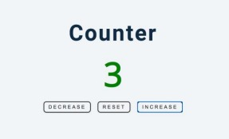

# Proyecto Dos
Instrucciones:
- Crear un contador el cual cuente con tres botones y sus respectivas funciones, 1. Disminuir,
2. Reiniciar, 3. Incrementar.
- Al ingresar a la página el contador debe de esta en cero, al momento de presionar
Incrementar el contador tiene que aumentar de numero uno por uno, dependiendo de la
cantidad de la cantidad que se presione el mismo botón.
- Al presionar el botón Disminuir el contador debe tener la capacidad de sustraer un numero
a la vez.
- El contador no se detiene al llegar a cero, si el usuario decide presionar más veces el botón
de disminuir, la pagina debe ser capaz de mostrar incluso números negativos.
- Por último, a cada número positivo debe estar representado con el color verde, cada
numero negativo debe ser representado con el color rojo y al cero se le puede agregar el
color que usted desee.
- Al terminar este proyecto subirlo a GitHub y compartirlo a quien corresponda.

## Imagen de Ejemplo


```diff 
- text in red 
+ text in green 
! text in orange 
# text in gray 
@@ text in purple (and bold)@@ 
```
